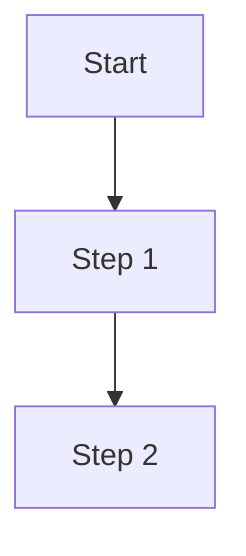

# Daily Notes Structure

Standard folder hierarchy and file conventions for daily work documentation.

## When to Use

Attach this rule when:
- Starting a new day (morning kickoff creates structure)
- Creating notes for a feature, bug, or research
- Organizing existing notes
- Looking up where things should go

---

## Folder Hierarchy

```
daily-notes/
└── YYYY/                          # Year (e.g., 2025)
    └── MM/                        # Month (e.g., 12)
        └── week-NN/               # ISO week number (e.g., week-50)
            └── DD/                # Day of month (e.g., 15)
                ├── README.md      # Daily index/overview
                ├── morning-startup.md
                ├── session-log.md
                ├── reflection.md
                ├── pickup-tomorrow.md
                ├── dev-work/      # Active development notes
                ├── pr-reviews/    # PR review notes
                │   ├── my-prs/
                │   └── reviewing/
                ├── research/      # Research and spikes
                ├── bugs/          # Bug investigations
                └── screenshots/   # Visual captures
```

---

## Daily Files

### README.md (Required)

Daily index showing today's focus and folder structure:

```markdown
# Daily Notes - [Month Day, Year]

## Today's Focus
**Primary:** [Main card/feature]
**Secondary:** [Other work]

---

## Folder Structure
```
2025-12-15/
├── README.md              <- You are here
├── morning-startup.md     <- Morning context
├── session-log.md         <- Running log
├── dev-work/              <- Feature notes
├── pr-reviews/            <- PR work
├── research/              <- Investigations
└── screenshots/           <- Visual captures
```

---

## Quick Links
- **Morning Startup:** [morning-startup.md](./morning-startup.md)
- **Session Log:** [session-log.md](./session-log.md)

## Open PRs
| PR | Repo | Status |
|----|------|--------|
| #1234 | platform | REVIEW_REQUIRED |

## Active Cards
- [#XXXX](link) - Card title

---

_Session started [date]_
```

### morning-startup.md

Generated by morning-kickoff.md:
- Overnight activity summary
- WIP status
- Mermaid diagrams
- Prioritized checklist

### session-log.md

Maintained by session-logging.md:
- Timestamped entries
- Progress, decisions, blockers
- Continuous throughout day

### reflection.md

Generated by end-of-day-reflection.md:
- What got done
- Blockers encountered
- Key insights
- Links to PRs/cards

### pickup-tomorrow.md

Generated by end-of-day-reflection.md:
- Quick start commands
- Where you left off
- Tomorrow's goals
- Conversation starter

---

## Subdirectory Contents

### dev-work/

Active development notes organized by feature:

```
dev-work/
├── feature-name.md           # Feature implementation notes
├── feature-name-analysis.md  # Pre-implementation analysis
└── card-XXXX-notes.md        # Card-specific notes
```

**File template:**
```markdown
# [Feature/Card Name]

**Card:** [#XXXX](link)
**Branch:** `feature/xxxx-description`
**PR:** [#YYYY](link) (when created)

---

## Context
[What this feature does, why it's needed]

## Implementation Notes
[Technical details, decisions, code snippets]

## Flow Diagram


## Testing Plan
- [ ] Test case 1
- [ ] Test case 2

## Related Files
- `path/to/file.tsx`

---

_Last updated: [timestamp]_
```

### pr-reviews/

PR review tracking:

```
pr-reviews/
├── my-prs/
│   └── pr-XXXX-description.md  # Notes on your PRs
└── reviewing/
    └── pr-YYYY-description.md  # Notes when reviewing others
```

**My PR template:**
```markdown
# PR #XXXX - [Title]

**Repo:** platform/community-web-app
**Status:** DRAFT -> REVIEW_REQUIRED -> APPROVED -> MERGED
**Created:** [date]
**Merged:** [date]

---

## Summary
[What this PR does]

## Review Feedback
| Reviewer | Feedback | Action |
|----------|----------|--------|
| @name | Comment | How addressed |

## Related
- Card: [#YYYY](link)
- Backend PR: [#ZZZZ](link)
```

### research/

Research and spike documentation:

```
research/
├── feature-[name].md       # Feature research
├── bug-[issue].md          # Bug investigation
├── arch-[topic].md         # Architecture spike
└── idea-[name].md          # Idea exploration
```

Uses templates from research-workflow.md.

### bugs/

Bug tracking and investigation:

```
bugs/
├── bug-XXXX-description.md
└── bug-YYYY-description.md
```

**Bug template:**
```markdown
# Bug #XXXX - [Title]

**Card:** [link]
**Severity:** Critical/High/Medium/Low
**Status:** Investigating -> Identified -> Fixed

---

## Problem
[Description of bug]

## Root Cause
[What's causing it]

## Fix
[How it was/will be fixed]

## PR
[Link when created]
```

### screenshots/

Visual captures for documentation:

```
screenshots/
├── feature-demo-YYYYMMDD.png
├── bug-repro-YYYYMMDD.png
└── architecture-diagram-YYYYMMDD.png
```

**Naming convention:** `[context]-[description]-YYYYMMDD.[ext]`

---

## Path Conventions

### Base Path
```
/Users/nathan.baker/code/daily-notes/
```

### Today's Folder
```bash
TODAY=$(date +%Y/%m/week-%V/%d)
mkdir -p "/Users/nathan.baker/code/daily-notes/$TODAY"
```

### Finding Recent Notes
```bash
# Yesterday's notes
find /Users/nathan.baker/code/daily-notes -name "*.md" -mtime -2

# This week's notes
find /Users/nathan.baker/code/daily-notes -name "*.md" -mtime -7

# Search for content
grep -r "feature name" /Users/nathan.baker/code/daily-notes/2025/
```

---

## Quick Setup Script

```bash
#!/bin/bash
# Create today's folder structure

BASE="/Users/nathan.baker/code/daily-notes"
YEAR=$(date +%Y)
MONTH=$(date +%m)
WEEK=$(date +week-%V)
DAY=$(date +%d)
DATE=$(date +%Y-%m-%d)

FOLDER="$BASE/$YEAR/$MONTH/$WEEK/$DAY"

mkdir -p "$FOLDER/dev-work"
mkdir -p "$FOLDER/pr-reviews/my-prs"
mkdir -p "$FOLDER/pr-reviews/reviewing"
mkdir -p "$FOLDER/research"
mkdir -p "$FOLDER/bugs"
mkdir -p "$FOLDER/screenshots"

# Create README if doesn't exist
if [ ! -f "$FOLDER/README.md" ]; then
  cat > "$FOLDER/README.md" << EOF
# Daily Notes - $(date +"%B %d, %Y")

## Today's Focus
**Primary:** [TBD]

---

## Folder Structure
\`\`\`
$(date +%Y-%m-%d)/
├── README.md
├── dev-work/
├── pr-reviews/
├── research/
├── bugs/
└── screenshots/
\`\`\`

---

_Session started $(date)_
EOF
fi

echo "Created: $FOLDER"
```

---

## Integration

- Created by morning-kickoff.md
- Updated by session-logging.md
- Closed out by end-of-day-reflection.md
- Research uses research-workflow.md templates
- Diagrams follow mermaid-diagrams.md conventions
