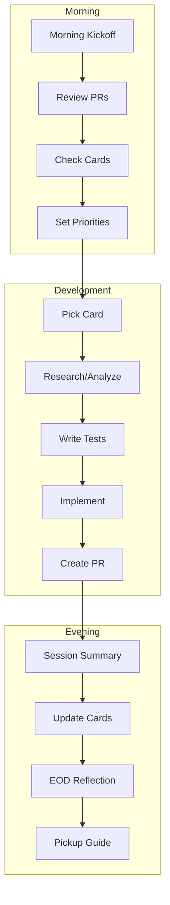
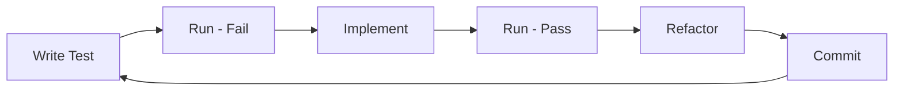

# Daily Development Workflow

**Entry point for all development work in the Fetch AI workspace.**

This workflow ensures consistent, test-driven development with proper GitHub integration, session logging, and communication.

---

## Quick Start

### Starting the Day

```
"Morning kickoff - generate my daily report"
```

This triggers morning-kickoff.md which:
- Creates today's notes folder structure
- Analyzes overnight GitHub activity
- Shows WIP cards and PRs
- Generates prioritized checklist

### During Development

```
"Starting work on card #XXXX"
```

This triggers:
- tdd-workflow.md for implementation
- session-logging.md for progress tracking

### End of Day

```
"End of day reflection"
```

This triggers end-of-day-reflection.md which:
- Summarizes today's work
- Creates pickup guide for tomorrow
- Optionally updates GitHub cards

---

## Workflow Overview



---

## Step 0: Verify Environment

Before starting, ensure:

```bash
# Check gh CLI is authenticated
gh auth status

# Check Slack token
source ~/.zshrc && echo $SLACK_CLI_TOKEN | head -c 10

# Pull latest staging branches (where the action happens)
cd /Users/nathan.baker/code/platform && git fetch origin staging && git log origin/staging --oneline -5
cd /Users/nathan.baker/code/clients && git fetch origin staging && git log origin/staging --oneline -5
```

### Why Staging Branches?

Feature, bugfix, and other branches get merged into `staging` - that's where the real activity happens. Checking your local feature branch only shows your own commits. Checking staging shows:
- What teammates merged overnight
- What conflicts might arise
- What context changed since you last worked

---

## Step 1: Morning Kickoff

**Goal:** Understand today's context before coding.

**Trigger:** "Morning kickoff" or start of day

**Uses:** morning-kickoff.md

**Output:**
- `daily-notes/YYYY/MM/week-NN/DD/morning-startup.md`
- Mermaid diagrams of active work
- Prioritized checklist

---

## Step 2: Pick and Analyze a Card

**Goal:** Understand before implementing.

**Trigger:** "Analyze card #XXXX" or "Research feature"

### Quick Card Pickup

```bash
# Read the card
gh issue view <NUMBER> --repo flockx-official/<REPO>

# Update card that you're starting
gh issue comment <NUMBER> --repo <REPO> --body "Starting work. Branch: \`feature/<NUMBER>-description\`"

# Create branch
git checkout staging && git pull
git checkout -b feature/<NUMBER>-description
```

### For Complex Features

Use research-workflow.md to:
- Analyze current vs desired behavior
- Map affected files and flows
- Create implementation plan
- Document in `research/feature-name.md`

---

## Step 3: Test-First Implementation

**Goal:** Write failing tests, then implement.

**Trigger:** "Implement card #XXXX" or "TDD this feature"

**Uses:** tdd-workflow.md

### The Cycle



### Quick Commands

```bash
# Platform tests
pytest app/tests/test_feature.py -v

# Clients component tests
pnpm --filter fetch-llm cypress run --component --spec "cypress/component/feature/**"

# Commit
git add .
git commit -m "feat(scope): description" -m "- detail 1" -m "- detail 2"
```

---

## Step 4: Create and Manage PR

**Goal:** Get code reviewed and merged.

**Uses:** github-flow.md

### Create PR

```bash
gh pr create --repo <REPO> \
  --title "feat(scope): description" \
  --body "## Summary
Implements #XXXX

## Changes
- Change 1
- Change 2

## Testing
- [ ] Tests added
- [ ] Manual verification" \
  --base staging
```

### Track PR Status

```bash
# Check status
gh pr view <PR_NUMBER> --repo <REPO> --json reviewDecision,state

# Address feedback, push, request re-review
gh pr comment <PR_NUMBER> --repo <REPO> --body "Addressed feedback, ready for re-review"
```

---

## Step 5: Session Logging

**Goal:** Capture progress as it happens.

**Trigger:** "Log: description" throughout the day

**Uses:** session-logging.md

### Log Types

```markdown
### [HH:MM] Progress: Fixed StreamLoader bug
**Card:** #3026
**Files:** `apps/fetch-llm/src/components/chat-messages.tsx`

Added mention check before showing loader.

---

### [HH:MM] Decision: Using view layer fix
**Context:** Race condition in loading state
**Chosen:** Fix at render time, not context layer
```

---

## Step 6: End of Day

**Goal:** Document progress, prepare for tomorrow.

**Trigger:** "End of day" or "Wrap up"

**Uses:** end-of-day-reflection.md

**Output:**
- `reflection.md` - What got done
- `pickup-tomorrow.md` - How to resume

---

## Communication Integration

### Slack Updates

Use slack-cli-integration.md for:
- Checking overnight messages
- Posting PR requests for review
- Responding to threads
- Sharing blockers

### GitHub Card Updates

Post progress to cards at key moments:
- Starting work
- Tests written
- Implementation complete
- PR ready

### Devon Meeting Updates

Use devon-meeting-updates.md for:
- Tuesday/Friday meeting prep
- Sprint progress summaries

---

## Rule Reference

### Daily Operations
| Rule | Purpose |
|------|---------|
| morning-kickoff.md | Start the day |
| session-logging.md | Track progress |
| end-of-day-reflection.md | Wrap up |

### Development
| Rule | Purpose |
|------|---------|
| tdd-workflow.md | Test-first implementation |
| testing-conventions.md | Test structure |
| github-flow.md | Git/PR workflow |

### Research
| Rule | Purpose |
|------|---------|
| research-workflow.md | Feature/bug analysis |
| mermaid-diagrams.md | Visualizations |

### Communication
| Rule | Purpose |
|------|---------|
| slack-cli-integration.md | Team chat |
| devon-meeting-updates.md | Client meetings |

### Organization
| Rule | Purpose |
|------|---------|
| daily-notes-structure.md | Folder structure |
| cursor-rules.md | Rule authoring |
| self-improve.md | Pattern recognition |

---

## Mission

**Solve 10+ problems per day** by:
- Starting with clear context (morning kickoff)
- Working test-first (TDD workflow)
- Logging continuously (session log)
- Communicating efficiently (Slack, GitHub)
- Ending with documentation (EOD reflection)
