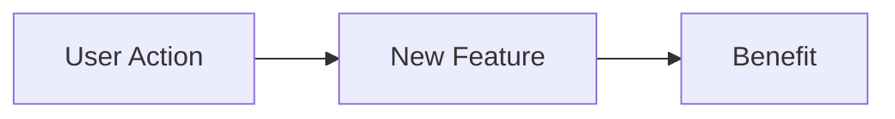

# Devon Meeting Updates

Generate structured updates for bi-weekly meetings with Devon (Fetch AI owner) to review development progress.

## When to Use

Attach this rule when you say:
- "Build a Devon update"
- "Meeting prep"
- "Devon update for today"
- "Generate client meeting notes"

## Meeting Schedule

**Days:** Tuesdays and Fridays
**Channel:** #ao-planning (C08CETC7YS2)

---

## Repositories to Review

| Repo | Path | GitHub |
|------|------|--------|
| Platform | `/Users/nathan.baker/code/platform` | `flockx-official/platform` |
| Clients | `/Users/nathan.baker/code/clients` | `flockx-official/community-web-app` |

---

## Update Generation Process

### Step 1: Gather Git Activity

```bash
# Determine date range (since last meeting)
# For Tuesday meeting: since last Friday
# For Friday meeting: since last Tuesday
SINCE_DATE="<LAST_MEETING_DATE>"

# Platform commits
cd /Users/nathan.baker/code/platform
echo "=== Platform Commits ==="
git log --oneline --since="$SINCE_DATE" --author="nathan" --pretty=format:"%h %s (%ad)" --date=short

# Clients commits
cd /Users/nathan.baker/code/clients
echo "=== Clients Commits ==="
git log --oneline --since="$SINCE_DATE" --author="nathan" --pretty=format:"%h %s (%ad)" --date=short
```

### Step 2: Get PR Status

```bash
# Platform PRs
gh pr list --author="@me" --state=all --limit=20 --repo flockx-official/platform

# Clients PRs
gh pr list --author="@me" --state=all --limit=20 --repo flockx-official/community-web-app

# Merged PRs since last meeting
gh pr list --author="@me" --state=merged --search="merged:>=$SINCE_DATE" --repo flockx-official/platform
gh pr list --author="@me" --state=merged --search="merged:>=$SINCE_DATE" --repo flockx-official/community-web-app
```

### Step 3: Get Cards from Project Board

```bash
# All Nathan's assigned cards
gh project item-list 8 --owner flockx-official --format json --limit 100 | \
  jq '[.items[] | select(.assignees != null and (.assignees | index("nathanbaker-ao")))]'
```

### Step 4: Get PR Details

For each relevant PR:

```bash
gh pr view <PR_NUMBER> --json title,body,state,additions,deletions,files,commits --repo <REPO>
```

---

## Output Template

Generate in `daily-notes/.../devon-update-YYYY-MM-DD.md`:

```markdown
# Devon Meeting Update - [DATE]

## Summary

[2-3 sentence overview of sprint progress since last meeting]

---

## Progress Overview

| Repository | PRs Merged | PRs Open | Lines Changed |
|------------|------------|----------|---------------|
| Platform   | X          | Y        | +A/-B         |
| Clients    | X          | Y        | +A/-B         |

---

## Completed Work

### [Feature/PR Name]

**PR:** [#XXXX](link) | **Status:** Merged
**Impact:** [Brief description of what this enables]



#### Key Changes
- Change 1
- Change 2

#### Files Modified
| Domain | Files |
|--------|-------|
| Components | 5 |
| API | 2 |
| Tests | 3 |

---

## In Progress

### [Card Title]

**Card:** [#XXXX](link)
**Branch:** `feature/xxxx-description`
**Status:** [X% complete]

**What's done:**
- [x] Task 1
- [x] Task 2

**What's next:**
- [ ] Task 3
- [ ] Task 4

**ETA:** [Timeframe]

---

## Blockers

| Issue | Blocked By | Impact | Action Needed |
|-------|------------|--------|---------------|
| [Item] | [Person/thing] | [What's delayed] | [What would help] |

---

## Next Steps

### This Week
1. [Priority 1]
2. [Priority 2]
3. [Priority 3]

### Coming Up
- [Future item 1]
- [Future item 2]

---

## Discussion Points

Questions or topics for Devon:
- [ ] [Question 1]
- [ ] [Question 2]

---

## Quick Links

### PRs (Open)
- [#XXXX](link) - Title

### PRs (Merged This Sprint)
- [#XXXX](link) - Title

### Cards (Active)
- [#XXXX](link) - Title

---

_Generated [timestamp]_
```

---

## Communication Best Practices

### In the Meeting

- Lead with wins (merged PRs, completed features)
- Be specific about progress percentages
- Proactive about blockers - mention before asked
- Clear ETAs with confidence levels

### Slack Follow-up

Post summary to #ao-planning after meeting:

```
Meeting Notes - [Date]

Completed: [High-level summary]
In Progress: [Current focus]
Next: [What's planned]

[Link to full notes if needed]
```

---

## Integration

- Uses github-flow.md for PR/card data
- Uses slack-cli-integration.md for posting
- Uses mermaid-diagrams.md for visualizations
- Outputs follow daily-notes-structure.md
