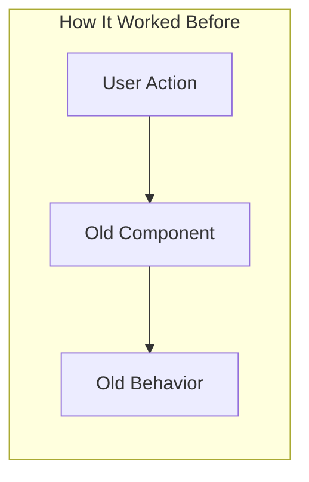
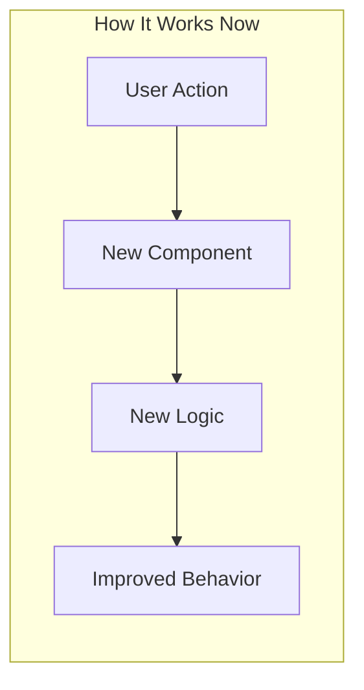

# End of Day Reflection

Generate a daily reflection that tells the story of your work with flow diagrams, architectural context, and narrative explanations that help you (and others) understand what was accomplished.

## When to Use

Attach this rule when you say things like:
- "Let's wrap up for the day"
- "End of day reflection"
- "EOD"
- "Prepare me for tomorrow"
- "Document today's progress"

## What It Does

1. **Gathers session context** from git, GitHub, and notes
2. **Creates architectural diagrams** showing what you changed
3. **Tells the story** of each significant change with file/function names
4. **Creates reflection.md** with full narrative documentation
5. **Creates pickup-tomorrow.md** with quick-start guide for next session
6. **Updates GitHub cards** with progress summaries (optional)

---

## Philosophy: Tell Your Story

At the end of the day, you should be able to answer:

- **What did I actually build/fix?** Not just commits, but what *changed* in the system
- **How does data flow differently now?** Before/after diagrams
- **What files, functions, models did I touch?** Specific names, not vague descriptions
- **Why did I make these decisions?** Context that will be forgotten by tomorrow
- **What's left to do?** Clear next steps with architectural context

**Every significant change gets a diagram + narrative** that tells the story.

---

## Process

### Step 1: Gather Today's Context

```bash
# Today's date
TODAY=$(date +%Y-%m-%d)

# Platform commits today (your work)
cd /Users/nathan.baker/code/platform
echo "=== Platform Commits Today ==="
git log --oneline --since="today 6am" --author="nathan" --pretty=format:"%h %s"

# Get detailed stats for your commits
git log --since="today 6am" --author="nathan" --stat --pretty=format:"%h %s" | head -50

# Clients commits today (your work)
cd /Users/nathan.baker/code/clients
echo "\n=== Clients Commits Today ==="
git log --oneline --since="today 6am" --author="nathan" --pretty=format:"%h %s"

# PR status updates
echo "\n=== My Open PRs ==="
gh pr list --author="@me" --state=open --repo flockx-official/platform --json number,title,state,reviewDecision
gh pr list --author="@me" --state=open --repo flockx-official/community-web-app --json number,title,state,reviewDecision

# PRs merged today
echo "\n=== PRs Merged Today ==="
gh pr list --author="@me" --state=merged --search="merged:>=$TODAY" --repo flockx-official/platform
gh pr list --author="@me" --state=merged --search="merged:>=$TODAY" --repo flockx-official/community-web-app
```

### Step 2: Analyze Session Log

Read today's session log for context:
```bash
cat /Users/nathan.baker/code/daily-notes/$(date +%Y)/$(date +%m)/week-$(date +%V)/$(date +%d)/session-log.md
```

### Step 3: Generate Reflection with Story

Create `reflection.md` in today's folder with architectural diagrams and narratives.

### Step 4: Generate Pickup Guide

Create `pickup-tomorrow.md` with context for resuming work.

---

## Reflection Template

```markdown
# Daily Reflection - [DATE]

## Today's Focus

**Primary Goal:** [What you set out to accomplish]
**Outcome:** Completed | In Progress | Blocked

---

## The Story of Today's Work

### Summary

[2-3 paragraph narrative of what you accomplished today. Write as if explaining
to a colleague who wasn't there. Name specific features, files, and decisions.]

---

## What I Built/Changed

### [Change 1: Feature/Fix Name]

**Card:** [#XXXX](link)
**PR:** [#YYYY](link)
**Status:** Merged | Open | Draft

#### The Before State



**What was happening:**
[Explain the problem or previous state. Name specific files and functions.]

#### The After State



**What I changed:**
[Explain the solution. Name the files, functions, and models you modified.]

#### Files Changed

| File | What Changed | Why |
|------|--------------|-----|
| `app/feature/handler.py` | Added `new_function()` | [Reason] |
| `apps/fetch-llm/src/components/Feature.tsx` | Updated state logic | [Reason] |

#### The Story

[Full narrative explanation: When a user [action], the system now [behavior].
I added `function_name()` in `file.py` which [does what]. This connects to
`OtherComponent` in the frontend via the `useFeatureHook()` hook.

The key insight was [decision/learning]. I chose this approach because [reasoning].]

---

## What Got Done

### PRs

| PR | Repo | Status | Description |
|----|------|--------|-------------|
| [#1234](link) | platform | MERGED | [What it does] |
| [#5678](link) | clients | REVIEW_REQUIRED | [What it does] |

### Commits

| Hash | Message | Files | Impact |
|------|---------|-------|--------|
| `abc123` | fix: description | 3 files | [Area affected] |
| `def456` | feat: description | 5 files | [Area affected] |

---

## Key Insights & Learnings

### Technical Discoveries

**[Discovery 1]:**
[What you learned about the codebase, a pattern, or an approach.
Name specific files or functions where you found this.]

### Decisions Made

**Decision:** [What you decided]
**Why:** [Reasoning]
**Alternatives considered:** [What you didn't do and why]

---

## Blockers / Waiting

| Item | Waiting For | Since | Impact |
|------|-------------|-------|--------|
| PR #5678 | Jonathan's review | Today | Can't merge to staging |

---

## Notes for Tomorrow

[Anything you want to remember that doesn't fit elsewhere. Context that will
help future-you understand what was happening.]

---

_Reflection generated [timestamp]_
```

---

## Pickup Tomorrow Template

```markdown
# Pickup Guide - [NEXT DAY DATE]

## Quick Start Command

```bash
# Check PR statuses
gh pr list --author="@me" --state=open --repo flockx-official/platform
gh pr list --author="@me" --state=open --repo flockx-official/community-web-app

# Fetch latest staging
cd /Users/nathan.baker/code/platform && git fetch origin staging
cd /Users/nathan.baker/code/clients && git fetch origin staging
```

## Where You Left Off

### The Context

[2-3 sentences about what you were doing. Not just "working on feature X" but
"implementing the frontend component for feature X, specifically the loading
state in `FeatureComponent.tsx`. The backend is done and merged."]

### Branch Status

| Repo | Branch | Status | Last Commit |
|------|--------|--------|-------------|
| platform | `feature/xyz` | Clean | `abc123 - feat: added handler` |
| clients | `feature/abc` | 2 uncommitted | Working on `Component.tsx` |

### Files You Were Working On

| File | What You Were Doing |
|------|---------------------|
| `apps/fetch-llm/src/components/Feature.tsx` | Adding loading state |
| `apps/fetch-llm/src/hooks/use-feature.ts` | Fixing error handling |

### Where You Stopped

**Last action:** [Specific description - "Added the loading state but haven't tested it yet"]

**Cursor was in:** `Feature.tsx` around line 145

---

## Morning Checklist

### Immediate
- [ ] Check if PR #1234 was reviewed overnight
- [ ] Check Slack #fetch-devs for any comments
- [ ] Rebase on latest staging if needed

### Continue Yesterday's Work
- [ ] [Specific task 1 with file name]
- [ ] [Specific task 2 with file name]

---

## Tomorrow's Goals

### Must Do
- [ ] [Highest priority - specific]
- [ ] [Second priority - specific]

### Should Do
- [ ] [If time allows]

---

## Context to Load

Start tomorrow's session with:

```
Good morning! Using morning-kickoff.md, let's start the day.

Yesterday I was implementing [feature] in [files]. The backend is done (PR #1234 merged).
I'm now working on the frontend in `apps/fetch-llm/src/components/Feature.tsx`.

Left off at: [specific point]
Next step: [specific task]

Let's check overnight activity and continue.
```

---

_Generated [timestamp] | Tomorrow is [day of week]_
```

---

## Integration

- Reads from session-logging.md session log
- Follows daily-notes-structure.md conventions
- Uses github-flow.md for PR analysis
- Uses slack-cli-integration.md for posting updates
- Uses mermaid-diagrams.md for visualizations
