# Mermaid Diagrams

Standard patterns and templates for mermaid diagrams used throughout daily notes, research, and documentation.

## When to Use Diagrams

**Always diagram:**

- Complex data flows
- Multi-step processes
- Architecture decisions
- Bug investigation flows
- Feature implementation phases
- State transitions
- API sequences

**Diagram triggers:**

- "Show me the flow"
- "Visualize this"
- "How does this work"
- "Diagram this architecture"

---

## Flowchart Patterns

### Basic Flow

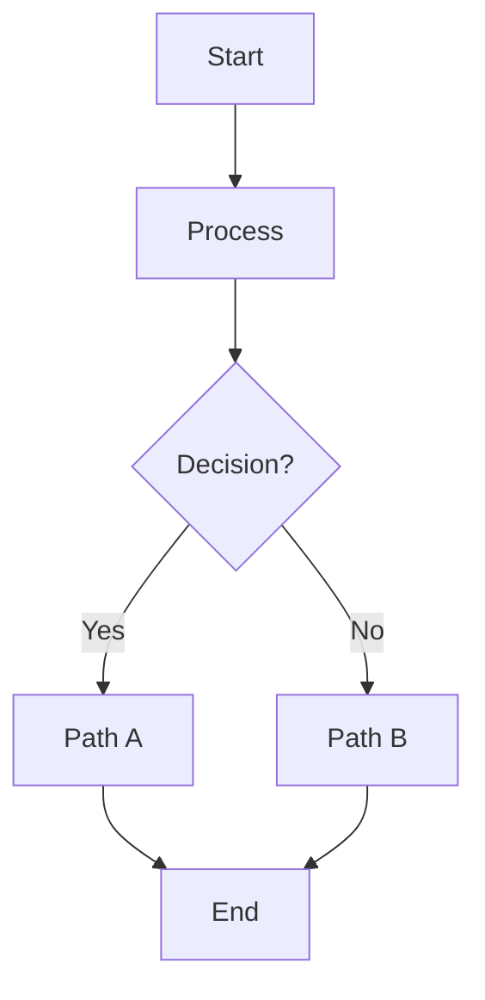

### Feature Implementation Flow

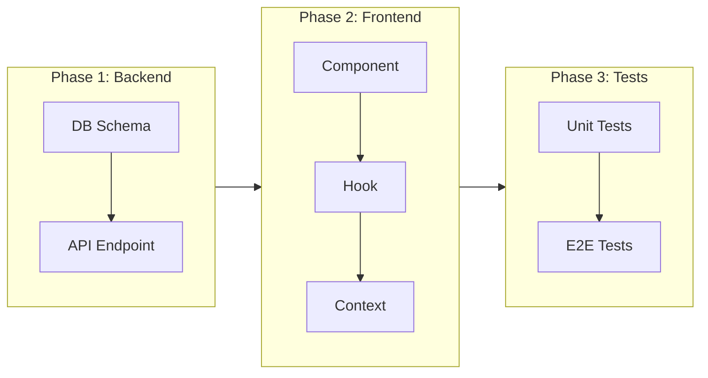

### Component Data Flow

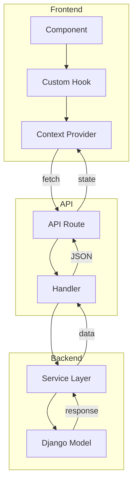

---

## Sequence Diagrams

### API Request Flow

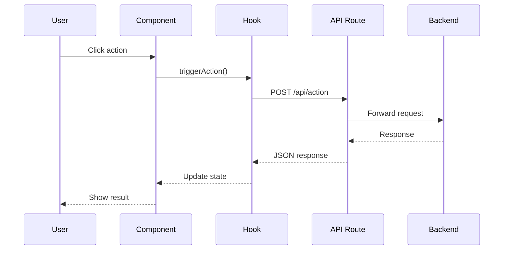

### WebSocket Flow

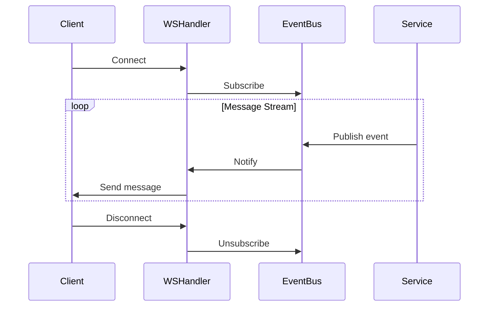

---

## State Diagrams

### PR Lifecycle

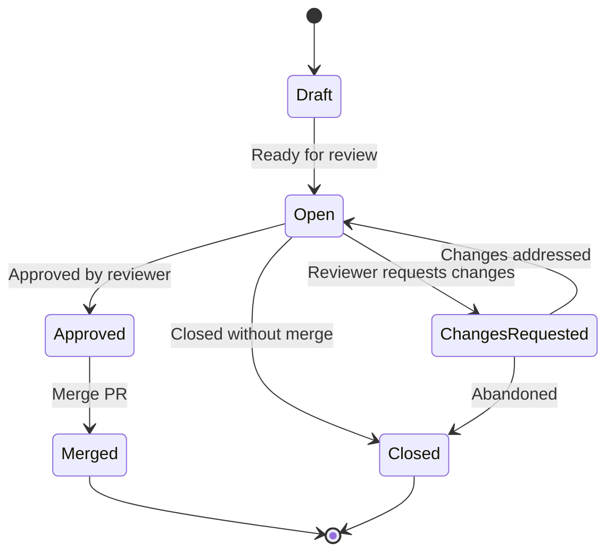

### Card Workflow

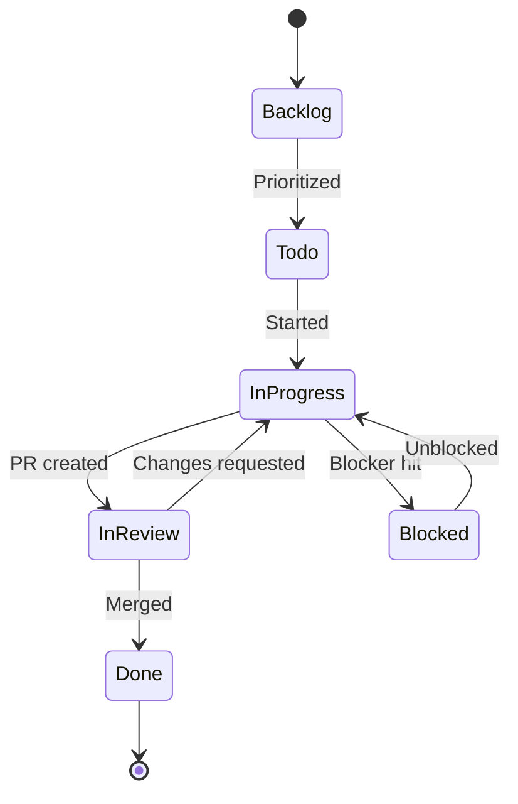

---

## Architecture Diagrams

### System Overview

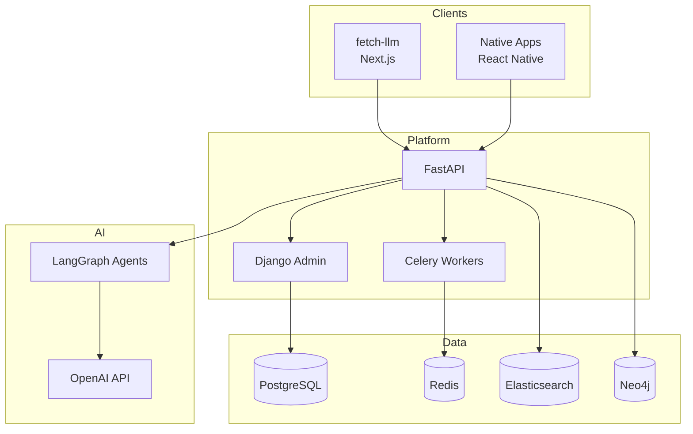

---

## Chart Diagrams

### Progress Visualization

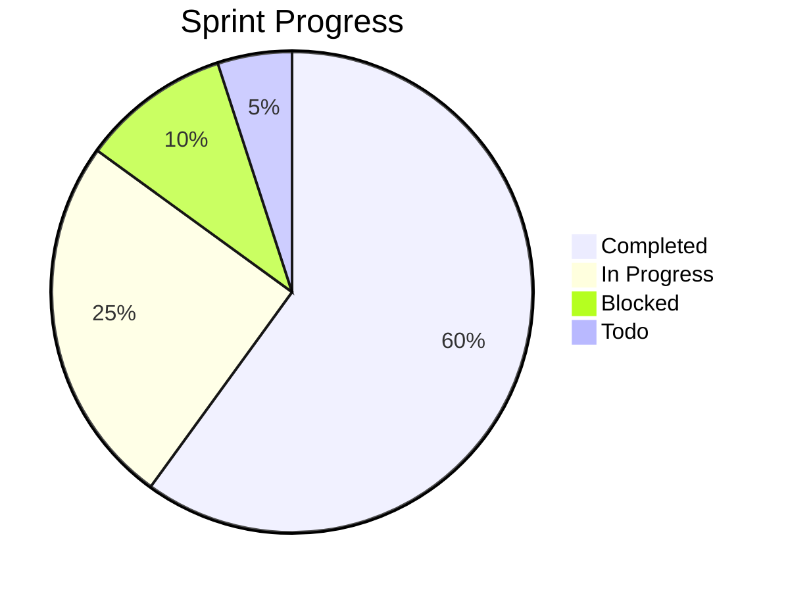

---

## Git Diagrams

### Branch Strategy

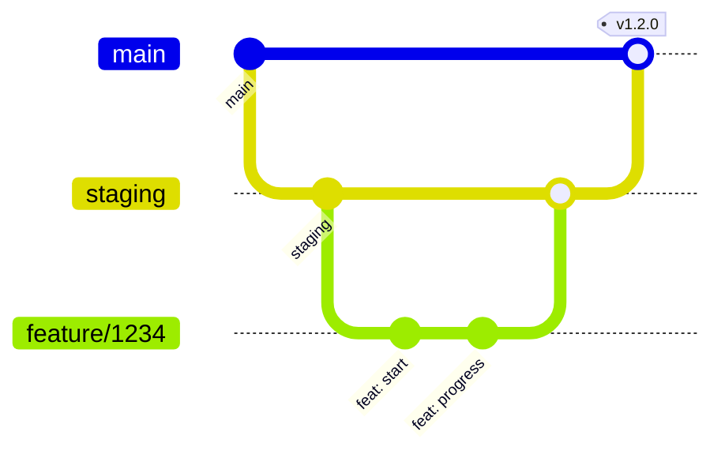

---

## Investigation Diagrams

### Bug Root Cause

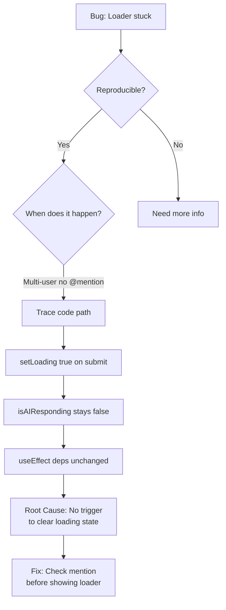

---

## Template Quick Reference

### When to use which:

| Scenario | Diagram Type |
|----------|--------------|
| Multi-step process | `flowchart TD/LR` |
| API interactions | `sequenceDiagram` |
| State transitions | `stateDiagram-v2` |
| System architecture | `flowchart TB` with subgraphs |
| Progress tracking | `pie` |
| Git workflow | `gitGraph` |

### Direction shortcuts:

- `TD` / `TB` - Top to bottom (vertical)
- `LR` - Left to right (horizontal)
- `RL` - Right to left
- `BT` - Bottom to top

### Node shapes:

- `[text]` - Rectangle
- `(text)` - Rounded rectangle
- `{text}` - Diamond (decision)
- `[(text)]` - Cylinder (database)
- `((text))` - Circle

### Line styles:

- `-->` - Solid arrow
- `-.->` - Dotted arrow
- `==>` - Thick arrow
- `--text-->` - Arrow with label
- `-->|text|` - Arrow with label (alt)

---

## Best Practices

1. **Keep diagrams focused** - One concept per diagram
2. **Use subgraphs** - Group related components
3. **Add context** - Labels on arrows explain relationships
4. **Color for emphasis** - Highlight problem areas in investigations
5. **Direction matters** - TD for hierarchies, LR for flows
6. **Update diagrams** - Keep them in sync with code changes
