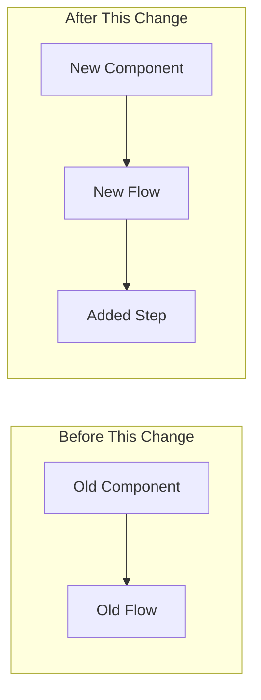

# Morning Kickoff

Generate a comprehensive daily startup report that tells the story of overnight changes with architectural diagrams and detailed explanations.

## When to Use

Attach this rule when you say things like:
- "Morning kickoff"
- "Start my day"
- "What happened overnight"
- "Daily startup report"
- "Morning sync"

## What It Does

1. **Creates daily notes folder structure** for today
2. **Analyzes overnight staging activity** with architectural context
3. **Generates flow diagrams** showing what areas teammates worked on
4. **Tells the story** of each significant change with file/function names
5. **Shows your work in progress** (cards, PRs, branches)
6. **Creates actionable morning checklist**

---

## Philosophy: Think Like an Architect

Before diving into code, understand:

- **What changed overnight?** Not just commits, but what *areas* of the system
- **Who touched what?** Which teammates worked on which flows
- **What might conflict?** Changes that overlap with your work
- **What context shifted?** New patterns, APIs, or approaches introduced

**Every significant change gets a diagram + narrative** that names files, functions, and explains the impact.

---

## Process

### Step 1: Create Today's Notes Structure

```bash
# Get current date components
YEAR=$(date +%Y)
MONTH=$(date +%m)
WEEK=$(date +%V)
DAY=$(date +%d)

# Create folder structure
mkdir -p "/Users/nathan.baker/code/fetch_workspace/daily-notes/$YEAR/$MONTH/week-$WEEK/$DAY"
mkdir -p "/Users/nathan.baker/code/fetch_workspace/daily-notes/$YEAR/$MONTH/week-$WEEK/$DAY/dev-work"
mkdir -p "/Users/nathan.baker/code/fetch_workspace/daily-notes/$YEAR/$MONTH/week-$WEEK/$DAY/pr-reviews"
mkdir -p "/Users/nathan.baker/code/fetch_workspace/daily-notes/$YEAR/$MONTH/week-$WEEK/$DAY/screenshots"
mkdir -p "/Users/nathan.baker/code/fetch_workspace/daily-notes/$YEAR/$MONTH/week-$WEEK/$DAY/research"
```

### Step 2: Gather Staging Activity (Overnight)

**Why staging?** Feature, bugfix, and other branches get merged into `staging` - that's where the real team activity happens.

```bash
# Platform - staging branch activity since yesterday
cd /Users/nathan.baker/code/fetch_workspace/platform
git fetch origin staging
echo "=== Platform Staging Commits (Overnight) ==="
git log origin/staging --oneline --since="yesterday 6pm" --pretty=format:"%h %s (%an)" | head -20

# Get detailed stats for significant commits
git log origin/staging --since="yesterday 6pm" --stat --pretty=format:"%h %s (%an)" | head -50

# Platform - open PRs targeting staging
echo "\n=== Platform Open PRs ==="
gh pr list --state=open --limit=20 --repo flockx-official/platform --base staging

# Clients - staging branch activity since yesterday
cd /Users/nathan.baker/code/fetch_workspace/clients
git fetch origin staging
echo "\n=== Clients Staging Commits (Overnight) ==="
git log origin/staging --oneline --since="yesterday 6pm" --pretty=format:"%h %s (%an)" | head -20

# Clients - open PRs targeting staging
echo "\n=== Clients Open PRs ==="
gh pr list --state=open --limit=20 --repo flockx-official/community-web-app --base staging
```

### Step 3: Analyze Changes Architecturally

For each significant overnight change, identify:

1. **What area of the system?** (API, frontend, models, services, etc.)
2. **What files were touched?** (List specific paths)
3. **What's the flow impact?** (How does data move differently now?)
4. **Does it affect my work?** (Conflicts, dependencies, patterns)

```bash
# See what areas changed in platform
cd /Users/nathan.baker/code/fetch_workspace/platform
git diff origin/staging@{yesterday}..origin/staging --stat | tail -20

# See what areas changed in clients
cd /Users/nathan.baker/code/fetch_workspace/clients
git diff origin/staging@{yesterday}..origin/staging --stat | tail -20
```

### Step 4: Get My Work in Progress

```bash
# My assigned cards from project board
gh project item-list 8 --owner flockx-official --format json --limit 100 | \
  jq '[.items[] | select(.assignees != null and (.assignees | index("nathanbaker-ao")))]'

# My open PRs - both repos
gh pr list --author="@me" --state=open --repo flockx-official/platform
gh pr list --author="@me" --state=open --repo flockx-official/community-web-app

# My branches with uncommitted work
cd /Users/nathan.baker/code/fetch_workspace/platform && git status --short
cd /Users/nathan.baker/code/fetch_workspace/clients && git status --short
```

### Step 5: Check Yesterday's Pickup Notes

```bash
# Find and read yesterday's pickup-tomorrow.md
find /Users/nathan.baker/code/fetch_workspace/daily-notes -name "pickup-tomorrow.md" -mtime -2 | head -1 | xargs cat
```

### Step 6: Slack Channel Highlights (Optional)

Check key channels for overnight activity:
- `#ao-planning` (C08CETC7YS2) - Devon communications
- `#fetch-devs` (C08C70B48PJ) - Team discussions, PR requests
- `#llm_issues` (C08V0EH4S7M) - Issue tracking
- `#fetchai-ao-internal` (C08960MC0RG) - Atomic Object Internal Team working on FetchAI client work internal convo
- `#bugs` (C06PM372SBT) - Reported bugs
- `#asi-one-mobile-app` (C0999KNTC7M) - Mobile Team discussions, PR requests ( I am tech lead here!!! so things here is really import) - External channel.
- `#fetch-llm` (C08B2ME3YKW) - FetchAI updates specifically. External chat with external clients.


---

## Output Template

Generate `morning-startup.md` in today's folder:

```markdown
# Morning Kickoff - [DATE]

## Daily Context

**Day:** [Day of Week], [Full Date]
**Your Active Branch (Platform):** [branch name]
**Your Active Branch (Clients):** [branch name]

---

## Overnight Staging Activity

### What Happened While You Were Away

[One paragraph summary: Who merged what? What areas of the system changed?
Any major features or fixes that landed?]

### Platform Staging Changes

| Commit | Author | Area | Description |
|--------|--------|------|-------------|
| `abc123` | Nick Hawn | Workflows | Added web search support |
| `def456` | Kelsey | Chat | Planner mode backend |

### Clients Staging Changes

| Commit | Author | Area | Description |
|--------|--------|------|-------------|
| `789ghi` | Ty Swanson | MCP | Non-pipedream enablement |
| `012jkl` | Meghan | Chat | Mobile chat v2 migration |

---

## Architectural Impact of Overnight Changes

### [Significant Change 1: Feature/Area Name]

**Who:** [Author name]
**PR:** [#XXXX](link)
**Files touched:**
- `app/feature/api_v2/handlers/...`
- `app/feature/services/...`



**The Story:**
[Author] added [feature description]. Before this change, [how it worked].
Now, when [trigger], the system [new behavior]. This was done by adding
`new_function()` in `file.py` which [explanation].

**Impact on Your Work:**
- [ ] Affects my current feature: [Yes/No - why]
- [ ] Need to rebase: [Yes/No]
- [ ] New pattern to follow: [Yes/No - what pattern]

---

## My Work in Progress

### Active Cards

| Card | Title | Status | Repo |
|------|-------|--------|------|
| #1234 | Card title | In Progress | platform |

### My Open PRs

| PR | Title | Status | Reviews | Next Action |
|----|-------|--------|---------|-------------|
| #5678 | PR title | REVIEW_REQUIRED | @reviewer | Wait / Address feedback |

---

## Morning Checklist

### From Yesterday's Pickup
- [ ] [First item from pickup-tomorrow.md]
- [ ] [Second item]

### Overnight Activity Response
- [ ] Review [teammate]'s changes to [area] - may affect my work
- [ ] Rebase my branch on latest staging
- [ ] Check if new pattern in [file] applies to my feature

### PR Actions
- [ ] Address feedback on PR #XXXX
- [ ] Review PR #YYYY (requested by [teammate])

### Today's Priority
- [ ] **P0:** [Highest priority item]
- [ ] **P1:** [Second priority]
- [ ] **P2:** [Third priority]

---

## Session Goals

By end of day, I want to:
1. [Goal 1]
2. [Goal 2]
3. [Goal 3]

---

_Generated [timestamp] via morning-kickoff.md_
```

---

## Integration

- Creates session log file automatically
- References daily-notes-structure.md for folder conventions
- Uses github-flow.md for PR/card analysis
- Uses slack-cli-integration.md for Slack highlights
- Outputs follow mermaid-diagrams.md conventions
