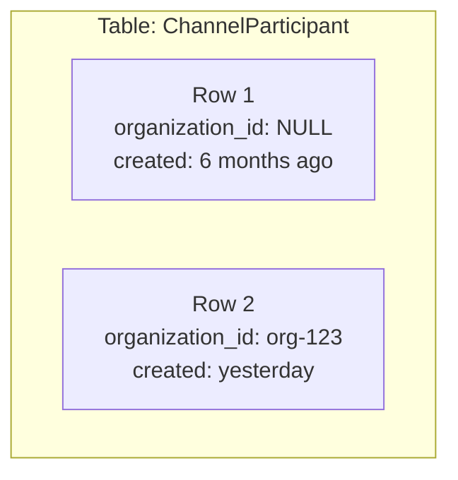
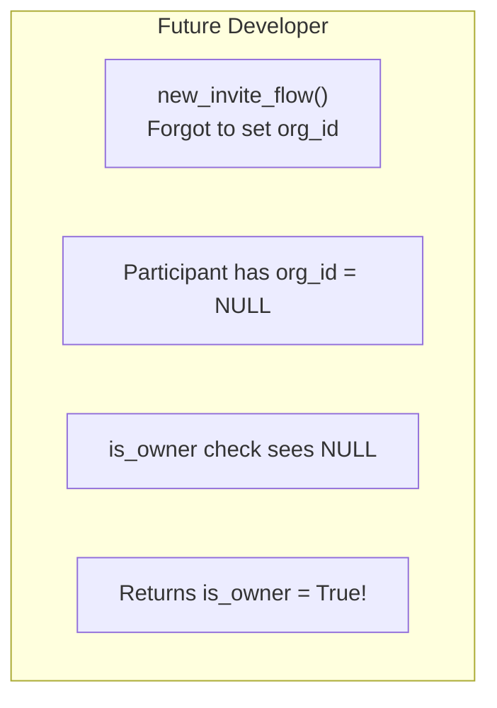
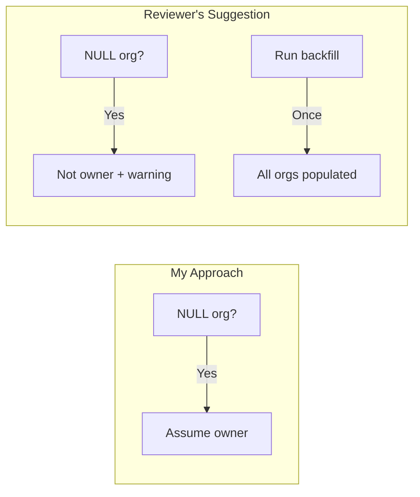
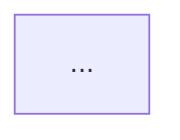

# PR Feedback Workflow

Systematically analyze reviewer feedback on your PRs using architectural diagrams **with detailed explanations** to understand what reviewers are asking for and why.

## When to Use

Attach this rule when you say:

- "Check my PR comments"
- "What do reviewers want"
- "Analyze PR feedback"
- "Address review comments"
- "Fix my PR"

---

## Philosophy: Tell Me a Story

Don't just show a diagram - **explain it like a consultant presenting to a client**.

For every diagram:

1. **Name files, functions, variables** - Be specific: "In `_participant_to_detail()` at line 255..."
2. **Explain the reasoning** - Why did I write it this way? What was I thinking?
3. **Show the risk** - What could go wrong? Paint a scenario.
4. **Reference adjacent code** - "The media access check in `dependencies.py` does it differently..."

---

## Process

### Step 1: Fetch Comments

```bash
# Get inline comments with file/line locations
gh api repos/flockx-official/platform/pulls/{PR_NUMBER}/comments \
  --jq '.[] | {author: .user.login, path: .path, line: .line, body: .body}'

# Get review-level feedback
gh pr view {PR_NUMBER} --repo flockx-official/platform \
  --json reviews --jq '.reviews[] | {author: .author.login, state: .state, body: .body}'
```

### Step 2: Read the Actual Code

Before diagramming, read:

1. **Your code** - The lines the reviewer commented on
2. **The model** - What does the data structure look like?
3. **Adjacent code** - How do similar features handle this?
4. **The migration** - If data-related, what did the migration do?

### Step 3: Create Diagrams WITH Explanations

Every diagram needs a **detailed explanation paragraph** below it.

---

## Diagram Types

### 1. Data State Diagram

Show the before/after state of data, especially for migrations or backfills.



### 2. Future Bug Scenario

Show what happens when someone makes a mistake in 6 months.



### 3. Approach Comparison

Show your approach vs. the reviewer's suggestion side by side.



---

## Output Template

Create feedback analysis in `daily-notes/YYYY/MM/week-NN/DD/pr-reviews/my-prs/`:

```markdown
# PR #{NUMBER} - Feedback Analysis

**PR:** [Title](url)
**Status:** REVIEW_REQUIRED
**Analyzed:** {date}

---

## Comment Summary

| Commenter | File | Type | Priority | Issue |
|-----------|------|------|----------|-------|
| name | path:line | Type | High/Med/Low | Summary |

---

## The Core Issue

### The Code I Wrote

```python
# file/path, lines N-M
your_code_here
```

**My reasoning was:** Explain what you were thinking.

### What Reviewer Said

> Quote from reviewer

---

## The Problem Visualized

### 1. [Diagram Name]



**What this diagram shows:** 3-5 sentences explaining:
- What the nodes/edges represent (cite specific files, functions, line numbers)
- Why this matters
- A realistic scenario of the problem

---

## Adjacent Flow: How Similar Code Handles This

Show code from elsewhere in the codebase that does something similar:

```python
# app/media/api_v2/dependencies.py, lines 11-24
def _check_media_organization_access(...)
```

**What this comparison shows:** Explain how the adjacent code is different and why that pattern is better.

---

## Comparison Table

| Aspect | My Approach | Reviewer's Approach |
|--------|-------------|---------------------|
| Safety | ... | ... |
| ... | ... | ... |

---

## Action Plan

### 1. [First Change]
**File:** path/to/file
**Change:** What to do

### 2. [Second Change]
...

---

## Response to Reviewer

> Draft response showing you understood their concern

---

_Analyzed using pr-feedback-workflow.md_
```

---

## Commenter Priority

| Source | Weight | Notes |
|--------|--------|-------|
| **Kelsey** | High | Senior reviewer, architecture focus |
| **Jonathan** | High | Senior reviewer |
| **Jared** | High | Team member |
| **Devon** | High | Product owner |
| **cursor[bot]** | Medium | Valid bugs, verify before fixing |
| **github-actions** | Medium | CI/automated checks |

Human reviewers always take priority over bots.
