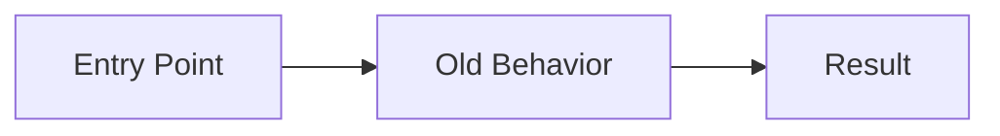
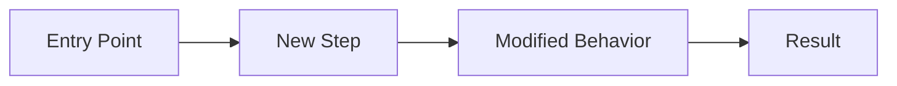

# PR Review Workflow

Personal workflow for reviewing PRs effectively by thinking like an architect. Produces detailed markdown files with mermaid diagrams and storytelling explanations.

## When to Use

Attach this rule when you say:
- "Review this PR"
- "Help me review"
- "PR review for #XXXX"
- "Understand this PR"
- "What does this PR do"

## What It Does

1. **Thinks from an architect's perspective** - focus on system design, not just code
2. **Generates before/after flow diagrams** from the diff
3. **Detects antipatterns** and architectural concerns
4. **Produces markdown review files** with detailed diagram explanations
5. **Names specific code elements** - files, models, functions, variables, dependencies
6. **Tells the story** of the change for fellow consultants

---

## Review Philosophy

### Think Like an Architect

**Architecture is the #1 priority.** Before nitpicking code style, ask:

- Does this change fit the existing system design?
- Are responsibilities in the right places?
- Does data flow through appropriate layers?
- Are there antipatterns being introduced?
- Will this scale? Is it maintainable?

### When to Clone vs. Review in Browser

| Situation | Approach |
|-----------|----------|
| Familiar with the code, small change | Review in GitHub UI |
| Large change across multiple files | Clone locally, check references and flows |
| Big fix without E2E test coverage | Clone and manually verify the flow |
| Unfamiliar area of codebase | Clone to trace dependencies |

### Context Before Code

When reviewing a PR, understand these before reading diffs:

1. **The problem being solved** - What's broken or missing?
2. **The flow before the change** - How does data move today?
3. **The flow after the change** - How will data move after this PR?
4. **Scope boundaries** - What's shared vs. feature-scoped?
5. **Alternative patterns** - Why this approach vs. others?

---

## Review Process

### Step 1: Gather PR Context

```bash
# Get PR details
gh pr view {NUMBER} --repo {OWNER}/{REPO} --json title,body,files,commits

# Get the diff
gh pr diff {NUMBER} --repo {OWNER}/{REPO}

# See what files changed
gh pr view {NUMBER} --repo {OWNER}/{REPO} --json files --jq '.files[].path'
```

### Step 2: Generate Before/After Flow Diagram

For every PR, create a diagram showing the request/response flow.

### Step 3: Map the Impact Radius

For any dependency that's modified, identify:

```bash
# Find who uses this function/class
grep -r "function_name" app/ --include="*.py" -l

# Find imports of the modified module
grep -r "from app.module import" app/ --include="*.py"
```

Then diagram:
- **Upstream:** What calls the modified code?
- **Downstream:** What consumes the output?
- **Neighbors:** What else uses the same dependencies?

### Step 4: Map Data Model Changes

If the PR touches models or schemas, create an ER diagram with explanation.

### Step 5: Create Component Dependency Graph

For changes that span multiple files, show the import/dependency structure.

---

## Review Checklist

### Architecture First (Top Priority)

| Question | What It Reveals |
|----------|-----------------|
| Does this fit the system design? | Alignment with existing architecture |
| Where does this logic live? | Service vs. handler vs. model |
| What's the scope? | Shared utility vs. feature-specific |
| Does this pattern exist elsewhere? | Reuse opportunity or inconsistency |
| What happens on failure? | Error handling completeness |
| What's the transaction boundary? | Data consistency |
| Will this scale? | Performance under load |
| Is this maintainable? | Can someone else understand it in 6 months? |

### Antipattern Detection

Watch for these architectural red flags:

| Antipattern | Why It's Bad | What to Suggest |
|-------------|--------------|-----------------|
| **God object** | One class doing too much | Extract focused services |
| **Tight coupling** | Components can't change independently | Dependency injection, interfaces |
| **Leaky abstraction** | Implementation details exposed | Clean boundaries |
| **Shotgun surgery** | One change requires many file edits | Consolidate related logic |
| **Feature envy** | Method uses another class's data excessively | Move method to data owner |
| **Deep nesting** | 3+ levels of if/for/try | Extract methods, early returns |

### Platform-Specific (Django/FastAPI)

- [ ] Uses Django ORM properly (no raw SQL unless necessary)
- [ ] Pydantic schemas for request/response
- [ ] Service layer for business logic
- [ ] Repository pattern for data access
- [ ] Proper error handling with HTTPException

### Clients-Specific (Next.js/React)

- [ ] Uses Orval SDK for API calls (not raw fetch)
- [ ] State management appropriate (URL state, context, or local)
- [ ] Components are focused and composable
- [ ] Proper loading/error states
- [ ] TypeScript types are correct

---

## Output Template

Create review notes in `daily-notes/YYYY/MM/week-NN/DD/pr-reviews/reviewing/`:

```markdown
# PR #{NUMBER} - {TITLE}

**Repo:** platform
**Author:** {author}
**Card:** #{card_number}
**Reviewed:** {date}

---

## Summary

{One paragraph explaining what this PR does and why it matters.}

---

## Flow Diagram

### Before



### After



### The Flow Explained

**Before this PR:**
{Detailed explanation naming files, functions, variables.}

**After this PR:**
{Detailed explanation of the new flow.}

---

## Files Changed

| File | Purpose | Notes |
|------|---------|-------|
| `path/to/file.py` | {What this file does} | {Specific observations} |

---

## Review Notes

### Looks Good
- {positive observation with specifics}

### Questions
- {question about approach - be specific}

### Suggestions
- {optional improvement with reasoning}

### Concerns
- {blocking issue if any - explain why}

---

## Verdict

**{APPROVE | REQUEST_CHANGES | COMMENT}**

{Final summary}
```

---

## Quick Review Commands

```bash
# View PR in browser
gh pr view {NUMBER} --repo {OWNER}/{REPO} --web

# Checkout PR locally
gh pr checkout {NUMBER} --repo {OWNER}/{REPO}

# Add review comment
gh pr review {NUMBER} --repo {OWNER}/{REPO} --comment -b "Comment text"

# Approve PR
gh pr review {NUMBER} --repo {OWNER}/{REPO} --approve -b "LGTM"

# Request changes
gh pr review {NUMBER} --repo {OWNER}/{REPO} --request-changes -b "Please fix X"
```
