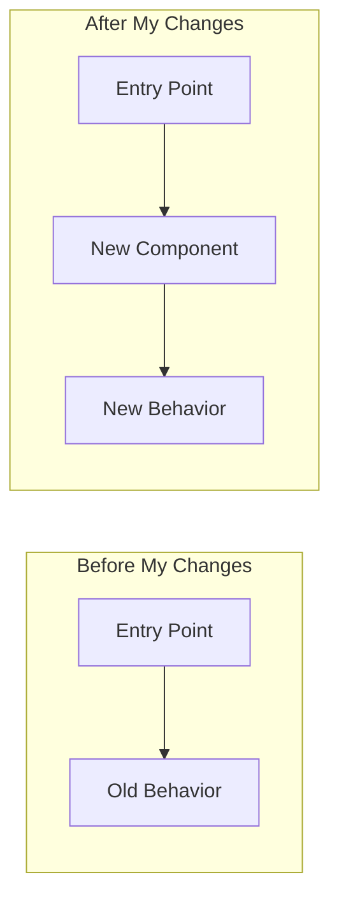

# Pre-Push Self Review

Review your own changes with the same architect mindset you'd apply to others' PRs. Catch issues before pushing, not after reviewers flag them.

## When to Use

Attach this rule when you say:

- "Review my changes"
- "Self review before push"
- "Check my work"
- "Pre-push review"
- "Am I ready to commit"
- "Sanity check my code"

---

## Philosophy: Be Your Own Harshest Critic

**Don't wait for reviewers to find issues.** Apply the same rigor you'd use reviewing a teammate's PR:

1. **Think like an architect** - Does this fit the system design?
2. **Visualize the flow** - Can you diagram what you built?
3. **Hunt for antipatterns** - Would you flag this in someone else's code?
4. **Name everything** - Files, functions, variables, models
5. **Imagine the future bug** - What breaks in 6 months?

---

## Process

### Step 1: Gather Your Changes

```bash
# See what files you've touched
git status --short

# See the actual diff (staged and unstaged)
git diff HEAD

# If comparing to staging
git diff origin/staging...HEAD --stat
```

### Step 2: List Changed Files with Purpose

| File | Purpose | Type of Change |
|------|---------|----------------|
| `path/to/file.tsx` | What it does | New / Modified / Deleted |

**Ask yourself:**
- Are these the RIGHT files to touch for this feature?
- Did I touch any files that shouldn't change?
- Is there a file I SHOULD have touched but didn't?

### Step 3: Create a Before/After Flow Diagram

Even for your own code, diagram the flow. This forces you to think architecturally.



### Step 4: Run the Antipattern Checklist

#### Architecture

| Question | If "No", Consider... |
|----------|----------------------|
| Does this fit the existing system design? | Discuss with team |
| Is the logic in the right layer? | Move to appropriate layer |
| Would someone understand this in 6 months? | Add comments or refactor |
| Am I duplicating logic that exists elsewhere? | Extract shared utility |
| Did I follow the patterns in adjacent code? | Check similar features |

#### Dependencies & Coupling

| Question | If "No", Consider... |
|----------|----------------------|
| Can this component change independently? | Reduce coupling |
| Are imports from appropriate modules? | Fix import structure |
| Am I exposing implementation details? | Create cleaner interfaces |

#### Data Flow

| Question | If "No", Consider... |
|----------|----------------------|
| Is data fetched at the right level? | Move queries up/down |
| Am I avoiding N+1 queries? | Use select_related/prefetch |
| Are null/undefined cases handled? | Add explicit checks |

#### Error Cases

| Question | If "No", Consider... |
|----------|----------------------|
| What happens if this fails? | Add error handling |
| Are errors specific and actionable? | Replace generic messages |
| Do loading states exist? | Add loading UI |

### Step 5: TypeScript/Lint Check

```bash
# Run typecheck
cd apps/<app-name>
PATH="$HOME/.nvm/versions/node/v20.16.0/bin:$PATH" pnpm run typecheck

# Run lint
pnpm run lint
```

**Do not commit if these fail.**

### Step 6: Identify the "Reviewer Questions"

What would a reviewer ask? Write them down and answer them preemptively:

| Anticipated Question | Your Answer |
|---------------------|-------------|
| "Why did you do X instead of Y?" | Because... |
| "What about edge case Z?" | Handled by... |
| "Should this be shared?" | No because... / Yes, will extract later |

---

## Red Flags to Catch Before Push

### Code Smells

| Smell | What to Do |
|-------|------------|
| Function > 50 lines | Extract helper functions |
| File > 400 lines | Split into modules |
| Nested 3+ levels deep | Early returns, extract methods |
| Copy-pasted code | Extract shared utility |
| Magic strings/numbers | Use constants |
| `any` type in TypeScript | Add proper types |
| `console.log` debugging | Remove before commit |
| Commented-out code | Delete it (Git has history) |

### Architecture Smells

| Smell | What to Do |
|-------|------------|
| Service calling repository of different domain | Go through that domain's service |
| Component fetching its own data | Lift data fetching up |
| Prop drilling 3+ levels | Use context or composition |
| Business logic in handler | Move to service layer |
| Raw fetch instead of Orval SDK | Use the generated SDK |

### React/Frontend Antipatterns (From PR Reviews)

| Antipattern | Why It's Wrong | What to Do Instead |
|-------------|----------------|-------------------|
| `useEffect` with arbitrary timeout for async data | Race condition | Add loading state to dependency array |
| Stripping markdown from agent output | Agent output IS markdown | Render with `ReactMarkdown` |
| Duplicate utility functions | Violates DRY | Consolidate into one function |
| Ignoring prop in favor of re-fetching same data | Breaks patterns | Use the prop OR remove it and fetch |

---

## Clients-Specific Checks (Next.js/React)

- [ ] Uses Orval SDK for API calls
- [ ] URL state with nuqs where appropriate
- [ ] Hero UI components for consistency
- [ ] Loading/error states in UI
- [ ] No inline styles (use Tailwind)
- [ ] Types are correct (no `any`)
- [ ] No dual data sources
- [ ] useEffect dependencies include async data states

## Platform-Specific Checks (Django/FastAPI)

- [ ] Uses repository pattern for data access
- [ ] Pydantic schema for request/response
- [ ] Service layer for business logic
- [ ] `select_related`/`prefetch_related` for relationships
- [ ] No raw SQL unless justified
- [ ] Migration generated (if models changed)

---

## Quick Self-Review (Abbreviated)

For small changes, do a mental check:

```
[ ] Does it work? (tested locally)
[ ] Does it fit? (follows patterns)
[ ] Does it fail gracefully? (errors handled)
[ ] Would I approve this from someone else?
```

If all yes -> commit and push.
