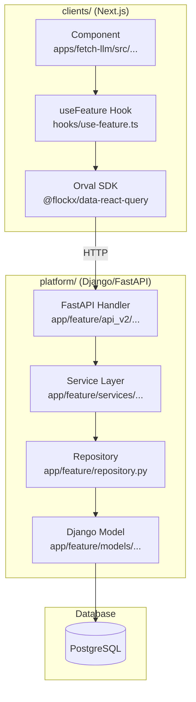
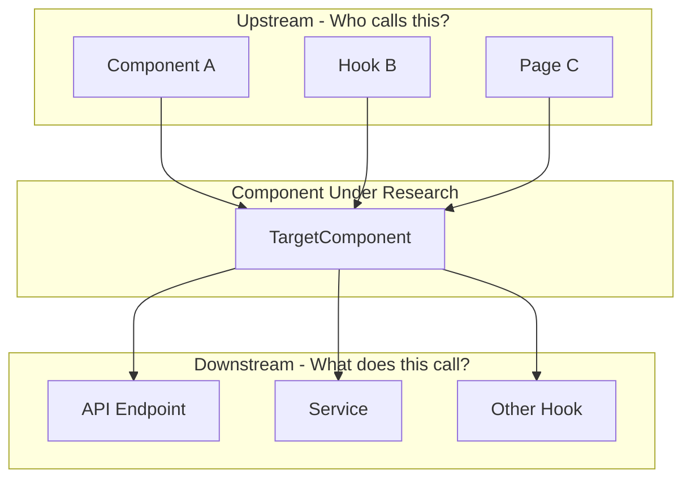

# Research Workflow

Fast onboarding workflow to understand architecture and data flows across the platform (Django) and clients (Next.js) repos. Produces detailed markdown with mermaid diagrams and storytelling explanations.

## When to Use

Attach this rule when you say:
- "Research this feature"
- "Onboard me to this area"
- "Deep dive into..."
- "How does X work?"
- "Analyze the flow for..."
- "Help me understand before implementing"

## What It Does

1. **Maps the full-stack flow** - from UI to API to database and back
2. **Generates architecture diagrams** with detailed narrative explanations
3. **Identifies impact radius** - upstream, downstream, and neighboring flows
4. **Names specific code elements** - files, functions, models, hooks, components
5. **Considers both repos** - platform (backend) and clients (frontend)
6. **Identifies data ownership** - who fetches, who receives, established patterns
7. **Checks existing capabilities** - what endpoints already exist before assuming new ones
8. **Prepares you for implementation** - understand before you code

---

## Research Philosophy

### Understand Before Implementing

**Architecture understanding is the #1 priority.** Before writing any code, know:

- How does data flow through the system today?
- What components are involved (frontend AND backend)?
- Where does state live and who owns it?
- What are the boundaries between layers?
- What patterns exist in the codebase?

### Cross-Repo Thinking

This workspace has TWO repos that work together:

| Repo | Stack | Location |
|------|-------|----------|
| **platform** | Django + FastAPI + LangGraph | `/Users/nathan.baker/code/platform` |
| **clients** | Next.js + React | `/Users/nathan.baker/code/clients` |

**Every research must consider both sides:**
- What API endpoints are involved?
- What frontend components consume them?
- What hooks/context manage the state?
- What Orval SDK functions are used?

### Diagrams + Storytelling

Code exploration shows *what* exists, but not:
- How components interact across layers
- The request/response lifecycle
- Why design decisions were made

**EVERY diagram must have a detailed explanation immediately following it.**

---

## Research Process

### Step 1: Define the Research Question

Be specific about what you want to understand:

```markdown
## Research Question

**What I want to understand:**
How does [feature X] work from user action to database and back?

**Why I need to know:**
I'm implementing [related feature Y] and need to understand the patterns.

**Specific questions:**
1. What API endpoints are involved?
2. How does the frontend manage state?
3. What models/schemas are used?
```

### Step 2: Map the Full-Stack Flow

Create a complete flow diagram showing both frontend and backend:



### Step 3: Identify Data Ownership Patterns

**CRITICAL: Before implementing, understand WHO owns data fetching.**

| Question | Why It Matters |
|----------|----------------|
| Which component fetches this data? | Establishes ownership - don't duplicate |
| Does data flow down as props? | If yes, children should USE the props |
| Are there hooks at multiple levels? | Could indicate pattern violation |
| Is there a config flag controlling fetching? | Understand the registry/config system |

### Step 4: Check Existing API Endpoints

**CRITICAL: Before assuming you need a new backend endpoint, check what already exists.**

```bash
# Check the OpenAPI docs
open https://staging-api.flockx.io/docs

# Or search for existing endpoints in platform
grep -r "router" platform/app/workflows/api_v2/ --include="*.py" -A 2

# Check Orval SDK for available hooks
grep -r "export.*use" clients/packages/data-react-query/src/ --include="*.ts" | grep workflow
```

### Step 5: Identify Entry Points

Find where to start in each repo:

```bash
# Find API endpoints for a feature
grep -r "router" platform/app/feature/api_v2/ --include="*.py" | head -10

# Find frontend components
grep -r "feature" clients/apps/fetch-llm/src/ --include="*.tsx" -l | head -10

# Find Orval SDK usage
grep -r "useGetFeature\|usePostFeature" clients/apps/fetch-llm/src/ --include="*.ts*" -l

# Find Django models
grep -r "class Feature" platform/app/ --include="*.py" -l
```

### Step 6: Map the Impact Radius

For any component you might modify, identify:



### Step 7: Document Key Files

Create a table of all relevant files:

```markdown
## Key Files

### Frontend (clients/)

| File | Purpose | Key Functions |
|------|---------|---------------|
| `apps/fetch-llm/src/components/feature/Feature.tsx` | Main UI component | `handleSubmit()`, `renderState()` |
| `apps/fetch-llm/src/hooks/use-feature.ts` | State management | `useFeature()`, `useFeatureAction()` |
| `packages/data-react-query/src/feature.ts` | Orval SDK | `useGetFeature()`, `usePostFeature()` |

### Backend (platform/)

| File | Purpose | Key Functions |
|------|---------|---------------|
| `app/feature/api_v2/handlers/list_features.py` | GET endpoint | `list_features()` |
| `app/feature/api_v2/handlers/create_feature.py` | POST endpoint | `create_feature()` |
| `app/feature/services/feature_service.py` | Business logic | `create()`, `get_by_id()` |
| `app/feature/models/feature.py` | Django model | `Feature` class |
| `app/feature/api_v2/schema.py` | Pydantic schemas | `FeatureCreate`, `FeatureResponse` |
```

---

## Output Format

### File Location

Create research notes in `daily-notes/YYYY/MM/week-NN/DD/research/`:

```
research/
└── [feature-name]-flow-analysis.md
```

### Required Sections

Every research file MUST include:

1. **Research Question** - What you're trying to understand and why
2. **Full-Stack Flow Diagram** - Frontend to Backend to Database
3. **Data Ownership Analysis** - Who fetches what, established patterns
4. **Existing Endpoint Assessment** - What's already available
5. **Key Files Table** - Both repos, with purpose and key functions
6. **Impact Radius Diagram** - Upstream, downstream, and neighboring flows
7. **Existing Patterns** - What patterns exist and whether to follow them
8. **Implementation Insights** - What you learned that affects implementation
9. **Open Questions** - What still needs clarification

---

## Best Practices

1. **No diagram stands alone** - Every diagram MUST have a detailed explanation immediately below
2. **Start with the user action** - Trace from UI click to database and back
3. **Name everything specifically** - Files, functions, line numbers, models
4. **Include code snippets** - Show critical logic inline, not just file references
5. **Consider both repos** - Frontend AND backend for every flow
6. **Find existing patterns first** - Don't reinvent, follow conventions
7. **Map impact radius** - Know what you might break and document risks
8. **Document as you discover** - Don't rely on memory
9. **Time-box research** - Set a limit (30-60 min), then decide if you need more
10. **Identify data ownership early** - Who fetches? Who receives? Don't duplicate.
11. **Check existing endpoints** - Before assuming new backend work is needed
