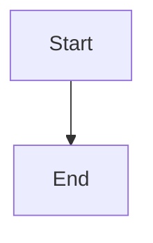

# Rule Authoring Guidelines

Standards for creating and updating Claude Code rules in this workspace.

---

## Rule File Location

All rules live in `.claude/rules/` directory:

```
workspace-claude-rules/
└── .claude/
    ├── CLAUDE.md           # Main index and overview
    └── rules/
        ├── daily-workflow.md
        ├── morning-kickoff.md
        └── ...
```

---

## Rule File Structure

### Header Section

Every rule should start with:

```markdown
# Rule Name

Brief description of what this rule does and when to use it.

## When to Use

Attach this rule when you say:
- "trigger phrase 1"
- "trigger phrase 2"
- "trigger phrase 3"
```

### Body Content

Include:

1. **Philosophy/Approach** - The "why" behind the rule
2. **Process Steps** - The "how" with specific commands
3. **Templates** - Output formats and examples
4. **Integration** - How this rule connects to others

### Code Blocks

Use fenced code blocks with language hints:

````markdown
```bash
# Shell commands
git status
```

```python
# Python code
def example():
    pass
```

```typescript
// TypeScript code
const example = () => {};
```


````

---

## Rule Types

### Workflow Rules

For multi-step processes:
- morning-kickoff.md
- end-of-day-reflection.md
- tdd-workflow.md

**Include:**
- Clear step-by-step process
- Commands for each step
- Output templates

### Reference Rules

For lookups and patterns:
- team-directory.md
- mermaid-diagrams.md
- testing-conventions.md

**Include:**
- Tables for quick reference
- Copy-pasteable snippets
- Examples

### Integration Rules

For external tools:
- slack-cli-integration.md
- github-flow.md

**Include:**
- API patterns
- Authentication notes
- Channel/endpoint references

---

## Naming Conventions

### File Names

- Use kebab-case: `morning-kickoff.md`
- Be descriptive: `pr-review-workflow.md` not `pr.md`
- Group related rules with prefix: `pr-*`, `daily-*`

### Rule Titles

- Start with noun or action: "Morning Kickoff", "PR Review Workflow"
- Match file name (converted to Title Case)

---

## Writing Style

### Be Specific

```markdown
# Good
When user types `git push`, first run `git status` to check for uncommitted changes.

# Bad
Before pushing, check things.
```

### Include Commands

```markdown
# Good
```bash
gh pr list --author="@me" --state=open
```

# Bad
Use the GitHub CLI to list your PRs.
```

### Show Templates

```markdown
# Good
## Output Template

```markdown
# PR Review - #{NUMBER}

**Author:** {author}
**Date:** {date}

## Summary
{description}
```

# Bad
Create a markdown file with the PR details.
```

---

## Cross-References

Link to related rules using relative markdown links:

```markdown
## Integration

- Uses templates from research-workflow.md
- Follows patterns in mermaid-diagrams.md
- Outputs to paths defined in daily-notes-structure.md
```

---

## Testing Rules

Before committing a new rule:

1. **Try the trigger phrases** - Do they invoke the rule correctly?
2. **Run the commands** - Do they work in your environment?
3. **Check the output** - Does the template produce valid markdown?
4. **Verify links** - Do cross-references resolve?

---

## Updating Rules

When updating existing rules:

1. **Note the change** - Add to version history if significant
2. **Check integrations** - Does this break other rules?
3. **Update CLAUDE.md** - If triggers or purpose changed

---

## Common Patterns

### Command Reference Table

```markdown
| Action | Command |
|--------|---------|
| List PRs | `gh pr list` |
| View PR | `gh pr view <number>` |
```

### Decision Tree

```markdown
### When to Use This Rule

- **If** you're starting your day -> morning-kickoff.md
- **If** you're ending your day -> end-of-day-reflection.md
- **If** you're implementing a feature -> tdd-workflow.md
```

### Checklists

```markdown
## Pre-Push Checklist

- [ ] TypeScript passes
- [ ] Lint passes
- [ ] Tests pass
- [ ] Self-reviewed diff
```

---

## Integration with CLAUDE.md

The main `CLAUDE.md` file serves as an index. When adding a new rule:

1. Add it to the appropriate section table
2. Include trigger phrases
3. Describe when to use it

```markdown
## Daily Workflow Rules

| Rule | When to Use | Trigger Phrases |
|------|-------------|-----------------|
| morning-kickoff.md | Start of day | "morning kickoff", "start my day" |
| **new-rule.md** | **[When]** | **"trigger 1", "trigger 2"** |
```
