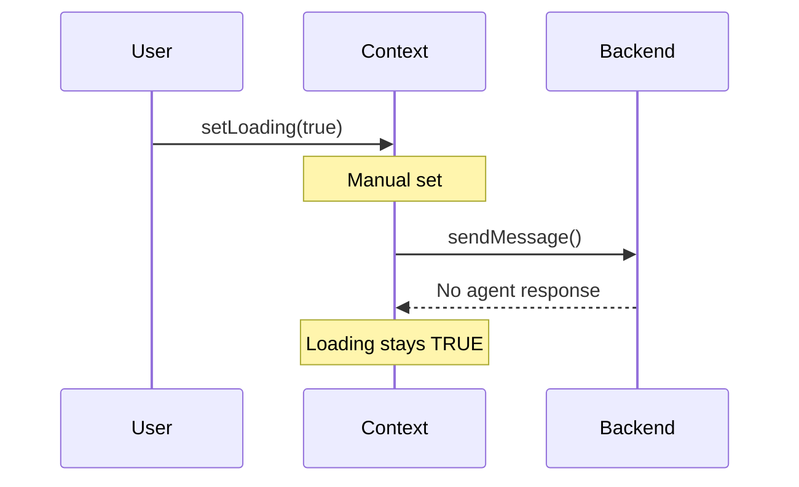

# Session Logging

Maintain a running log throughout the work session to capture progress, decisions, and context.

## When to Use

This rule activates throughout the day when you:
- Make progress on a task
- Encounter and solve a problem
- Make a decision that needs documenting
- Want to capture context for later

Trigger phrases:
- "Log this"
- "Session note"
- "Update session"
- "Add to log"
- "Capture this"

## What It Does

1. **Maintains session-log.md** in today's folder
2. **Timestamps entries** automatically
3. **Categorizes** entries by type (progress, decision, blocker, insight)
4. **Links to relevant** PRs, cards, and files
5. **Feeds into** end-of-day reflection

---

## Session Log Format

The session log lives at `daily-notes/YYYY/MM/week-NN/DD/session-log.md`:

```markdown
# Session Log - [DATE]

## Session Start: [TIME]
**Branch (Platform):** [branch]
**Branch (Clients):** [branch]
**Primary Card:** [#XXXX]

---

## Log Entries

### [HH:MM] Session Started
- Loaded context from pickup-tomorrow.md
- Starting work on card #1234
- Goals: [list from morning-startup]

---

### [HH:MM] Progress: [Brief Title]
**Card:** #1234
**Files:** `path/to/file.tsx`

[Description of what was accomplished]

```diff
+ Added participant badge component
+ Created useChatParticipants hook
- Removed legacy participant logic
```

---

### [HH:MM] Investigation: [Topic]
**Card:** #1234

**Question:** Why is the loader showing indefinitely?

**Findings:**
1. `isAIResponding` never changes when agent isn't invoked
2. The useEffect dependencies don't trigger re-run
3. Race condition between manual state set and backend response

**Diagram:**


---

### [HH:MM] Decision: [What Was Decided]
**Context:** [Why this came up]
**Options Considered:**
1. Option A - [pros/cons]
2. Option B - [pros/cons]

**Chosen:** Option A because [reasoning]

**Impact:** [What this affects]

---

### [HH:MM] Blocker: [Issue]
**Blocked By:** [Person/thing]
**Impact:** Cannot continue [task] until resolved
**Action:** Posted in Slack #fetch-devs, waiting for response

---

### [HH:MM] Note: [Quick Note]
[Random observation, reminder, or thought worth capturing]

---

### [HH:MM] Milestone: [Achievement]
**PR:** #5678 merged!
**Impact:** [What this enables]

---

## Session Summary
**Duration:** [X hours]
**Commits:** [count]
**PRs Updated:** [list]
**Cards Touched:** [list]

---

_Session log for [date]_
```

---

## Entry Types and Icons

| Type | Icon | When to Use |
|------|------|-------------|
| Session Start | Start | Beginning of work session |
| Progress | Progress | Completed a meaningful chunk of work |
| Investigation | Investigation | Deep dive into a problem |
| Decision | Decision | Made a choice that needs documenting |
| Blocker | Blocker | Hit a wall, waiting on something |
| Note | Note | Quick thought or observation |
| Milestone | Milestone | PR merged, feature complete, etc. |
| Break | Break | Stepping away (optional) |
| Resume | Resume | Back from break |

---

## Quick Log Commands

### Add Progress Entry
```
User: "Log: Fixed the StreamLoader race condition by adding message mention check"

AI: [Appends to session-log.md]
### [13:45] Progress: Fixed StreamLoader Race Condition
**Card:** #3026
**Files:** `apps/fetch-llm/src/components/chat-messages.tsx`

Fixed the loader showing indefinitely in multi-user chats when no agent is @mentioned.
Added `expectsAgentResponse` check before showing StreamLoader.
```

### Add Investigation Entry
```
User: "Log investigation: Traced the loading state flow through messages-context"

AI: [Creates detailed investigation entry with findings]
```

### Add Decision Entry
```
User: "Log decision: Using Option A (view layer fix) instead of Option B (context layer)"

AI: [Creates decision entry with reasoning]
```

---

## Automatic Logging

The AI should proactively log:
1. **After completing a sub-task** in a feature
2. **After pushing commits** - note what was committed
3. **After PR updates** - status changes, reviews
4. **When encountering errors** - capture for debugging
5. **When switching contexts** - note where you left off

---

## Integration with Other Rules

### Links to Cards/PRs
```markdown
### [14:30] Progress: PR Review Feedback Addressed
**PR:** [#2953](https://github.com/flockx-official/community-web-app/pull/2953)
**Card:** [#8168](https://github.com/flockx-official/community-web-app/issues/8168)

Addressed Jonathan's feedback:
- Removed app-level cursor rules from diff
- Simplified Cypress spec to single happy-path test
- Requested re-review
```

### Mermaid Diagrams in Logs
Always include mermaid diagrams for:
- Complex flows being debugged
- Architecture decisions
- Data flow investigations

### Feeding End-of-Day
The session log is the primary source for:
- end-of-day-reflection.md reflection generation
- Generating PR summaries
- Updating GitHub cards

---

## Best Practices

1. **Log frequently** - better too much than too little
2. **Include file paths** - helps reconstruct context
3. **Add mermaid diagrams** - visualize complex flows
4. **Link everything** - PRs, cards, Slack threads
5. **Capture reasoning** - why, not just what
6. **Note blockers immediately** - don't forget them
