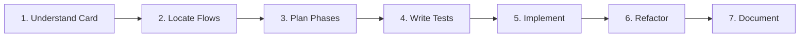
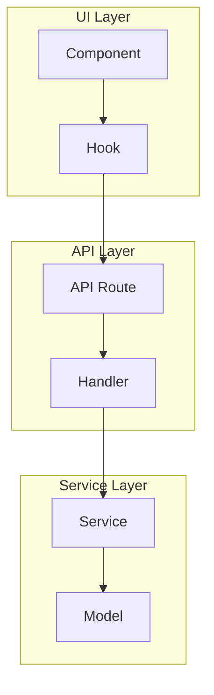

# TDD Workflow

Test-driven development workflow for implementing features and fixes across platform and clients repositories.

## When to Use

Attach this rule when:
- Starting work on a GitHub card
- Implementing a new feature
- Fixing a bug
- Changing behavior in the codebase

---

## Workflow Overview



---

## Step 1: Understand the Card

**Goal:** Analyze before coding. No implementation yet.

### Read the Card

```bash
# View issue details
gh issue view <NUMBER> --repo flockx-official/<REPO>

# Get full context
gh issue view <NUMBER> --repo <REPO> --json title,body,labels,assignees
```

### Summarize

Document in notes or as card comment:

```markdown
## Card Analysis

**Current behavior:**
[What happens now]

**Desired behavior:**
[What should happen]

**Acceptance criteria:**
- [ ] Criterion 1
- [ ] Criterion 2

**Constraints:**
- [Any limitations]

**Edge cases:**
- [Potential edge cases]

**Ambiguities/Questions:**
- [Things needing clarification]
```

---

## Step 2: Locate the Flows

**Goal:** Map where changes need to happen.

### Find Entry Points

```bash
# Search for related code
grep -r "keyword" --include="*.tsx" apps/fetch-llm/src/
grep -r "keyword" --include="*.py" app/

# Find component usages
grep -r "ComponentName" --include="*.tsx" apps/
```

### Create Flow Map



### Document in Notes

```markdown
## Flow Map

**Entry points:**
- `apps/fetch-llm/src/components/feature/component.tsx` - UI trigger
- `apps/fetch-llm/src/hooks/use-feature.ts` - Data fetching

**Domain logic:**
- `apps/fetch-llm/src/utils/feature-utils.ts` - Business logic

**Integration points:**
- `apps/fetch-llm/src/app/api/feature/route.ts` - API endpoint
- `app/api/v2/feature/` - Backend endpoint

**Path:** Component -> Hook -> API Route -> Backend -> Database
```

---

## Step 3: Plan in Phases

**Goal:** Break work into reviewable chunks.

### Phase Template

```markdown
## Phase 1: [Name]
**Scope:** [What's included]
**Dependencies:** [What must exist first]

**Changes:**
- [ ] File 1 - [change description]
- [ ] File 2 - [change description]

**Tests:**
- [ ] Test case 1
- [ ] Test case 2

---

## Phase 2: [Name]
[Continue pattern]
```

### Phase Guidelines

- Each phase should be independently testable
- Order by dependency (lowest first)
- Aim for < 400 lines changed per phase
- Each phase should result in a commit

---

## Step 4: Write Tests First

**Goal:** Define expected behavior before implementing.

### Test Layers (Bottom-Up)

1. **Pure/domain logic** - Unit tests
2. **Services/use-cases** - Integration tests
3. **API/transport layer** - API tests
4. **UI/components** - Component tests

### Platform Tests (pytest)

```python
# app/tests/test_feature.py
import pytest
from app.services.feature_service import FeatureService

class TestFeatureService:
    @pytest.mark.django_db
    def test_creates_feature_successfully(self, user):
        """Feature is created with valid input."""
        service = FeatureService()
        result = service.create(user=user, name="Test")

        assert result.id is not None
        assert result.name == "Test"

    @pytest.mark.django_db
    def test_raises_on_invalid_input(self, user):
        """Raises ValidationError for invalid input."""
        service = FeatureService()

        with pytest.raises(ValidationError):
            service.create(user=user, name="")
```

### Clients Tests (Cypress)

```typescript
// cypress/component/feature/component.cy.tsx
import { mount } from 'cypress/react18';
import { FeatureComponent } from '@/components/feature';

describe('FeatureComponent', () => {
  it('renders initial state correctly', () => {
    mount(<FeatureComponent data={mockData} />);
    cy.contains('Expected text').should('be.visible');
  });

  it('handles user interaction', () => {
    mount(<FeatureComponent data={mockData} />);
    cy.get('[data-testid="action-button"]').click();
    cy.contains('Updated state').should('be.visible');
  });
});
```

### Run Tests (Expect Failure)

```bash
# Platform
cd /Users/nathan.baker/code/platform
pytest app/tests/test_feature.py -v

# Clients
cd /Users/nathan.baker/code/clients
pnpm --filter fetch-llm cypress run --component --spec "cypress/component/feature/**"
```

---

## Step 5: Implement to Green

**Goal:** Minimum code to make tests pass.

### Implementation Guidelines

- Only write code needed to pass tests
- Follow existing patterns in codebase
- Keep changes focused on current phase
- Don't over-engineer

### Run Tests Until Green

```bash
# Platform - run specific test
pytest app/tests/test_feature.py::TestFeatureService::test_creates_feature -v

# Run all related tests
pytest app/tests/test_feature.py -v

# Clients - run component tests
pnpm --filter fetch-llm cypress run --component --spec "cypress/component/feature/**"
```

### Commit When Green

```bash
git add .
git commit -m "feat(feature): implement phase 1 - core logic" \
  -m "- Added FeatureService" \
  -m "- Added tests for happy path and edge cases" \
  -m "" \
  -m "Related to #XXXX"
```

---

## Step 6: Refactor

**Goal:** Improve code quality while keeping tests green.

### Refactoring Checklist

- [ ] Remove duplication
- [ ] Extract helper functions
- [ ] Improve naming
- [ ] Simplify conditionals
- [ ] Add type annotations

### Run Tests After Refactor

```bash
# Ensure nothing broke
pytest app/tests/ -v --tb=short
pnpm --filter fetch-llm cypress run --component
```

---

## Step 7: Document

**Goal:** Update card and prepare for review.

### Update GitHub Card

```bash
gh issue comment <NUMBER> --repo <REPO> --body "
## Implementation Complete

**Phase 1 (Core Logic):** Done
- Added FeatureService with create/update methods
- Tests: 5 passing

**Phase 2 (API):** Done
- Added /api/feature endpoint
- Tests: 3 passing

**PR:** #YYYY

**Ready for review.**
"
```

### Create PR

```bash
gh pr create --repo <REPO> \
  --title "feat(feature): implement feature name" \
  --body "## Summary
Implements #XXXX

## Changes
- Added FeatureService for business logic
- Added API endpoint
- Added component for UI

## Testing
- 8 unit tests added
- 3 component tests added

## Screenshots
[If UI changes]
" \
  --base staging
```

---

## Testing Conventions

### Platform (Python/Django)

| Test Type | Location | Naming |
|-----------|----------|--------|
| Unit | `app/tests/unit/` | `test_*.py` |
| Integration | `app/tests/integration/` | `test_*.py` |
| API | `app/tests/api/` | `test_*.py` |

### Clients (TypeScript/React)

| Test Type | Location | Naming |
|-----------|----------|--------|
| Component | `cypress/component/<feature>/` | `*.cy.tsx` |
| E2E | `cypress/e2e/` | `*.cy.ts` |

### Test Naming

```python
# Platform
def test_<action>_<scenario>():
    """<Description of what is being tested>."""

def test_creates_feature_with_valid_input():
    """Feature is created when input is valid."""

def test_raises_error_when_name_empty():
    """ValidationError raised when name is empty."""
```

```typescript
// Clients
describe('ComponentName', () => {
  it('<action> when <condition>', () => {
    // Test
  });

  it('renders loading state initially', () => {});
  it('displays data when fetch succeeds', () => {});
  it('shows error message when fetch fails', () => {});
});
```

---

## Integration

- Uses github-flow.md for branch/PR workflow
- Follows testing-conventions.md for test structure
- Updates session-logging.md with progress
- Research phase uses research-workflow.md

---

## Quick Reference

### Start Feature

```
1. Read card: gh issue view <NUMBER>
2. Summarize behavior change
3. Map affected files
4. Plan phases
5. For each phase: test -> implement -> commit
```

### Quick Fix (Bug)

```
1. Write test reproducing bug
2. Verify test fails
3. Fix bug minimally
4. Verify test passes
5. Commit with fix: message
```
